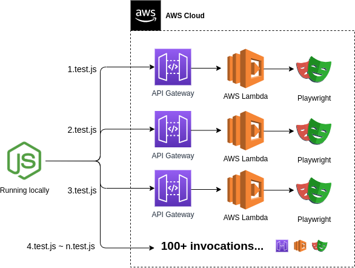
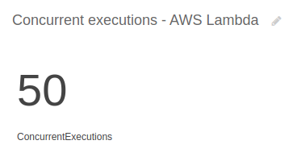
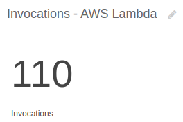
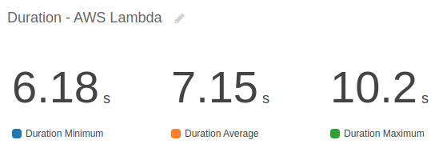

# Running hundreds of Playwright tests in a few seconds with AWS Lambda

This project has a playwright implementation so that it is consumed via AWS Lambda, allowing to parallelize the execution of all files and making the execution much faster.

The success of this implementation demonstrates that, in scenarios where E2E testing is needed to validate critical behaviors that are not possible in another type of test, it is possible to use AWS Lambda to run this same test on all Pull Requests, not just a few times in day.

## Result

With playwright on serverless it was possible to run 110 files, with 221 tests, in less than 25 seconds.
This same test running without parallelization would take 23 minutes. 

> To see the execution in detail, you can access the [pipeline log by clicking here](https://github.com/PauloGoncalvesBH/playwright-serverless/runs/3407401614?check_suite_focus=true#step:7:1).

The gif below demonstrates the execution:

 

## Pricing

Running hundreds of Lambda functions that last a few seconds has little impact on the final cost.

AWS Lambda Price:

> The AWS Lambda free usage tier includes 1M free requests per month and 400,000 GB-seconds of compute time per month.

Source: https://aws.amazon.com/lambda/pricing/

## Application diagram

 

## CloudWatch metrics

Below are some important CloudWatch metrics.

110 lambda functions were invoked, however my account has a limit of 50 parallel executions, which made the total execution double in time. 

The average time that a lambda function takes to run is 7 seconds, which is less than the total of 23 seconds that takes to run the test.

**However 23 seconds is a quiet time to wait when running an E2E test in a pipeline. I think we both agree that it's better than 23 minutes.**

### Parallel executions

Limited to 50.

 

### Invocations

1 invocation per test file in [./tests/E2E](./tests/E2E).

 

### Duration

The longest running lambda function was 10.2 seconds, less than half of the total execution time of all functions.

With a higher concurrent execution we would have better results in total time.

 

## More information

To understand how tests are run and AWS Lambda is built I recommend accessing the pipelines in [./.github/workflows/](./.github/workflows/) and the [Makefile](./Makefile).

___

[LICENSE GNU General Public License v3.0](./LICENSE)